# 한 문제씩, 한 조각씩 Buzzle 🧩

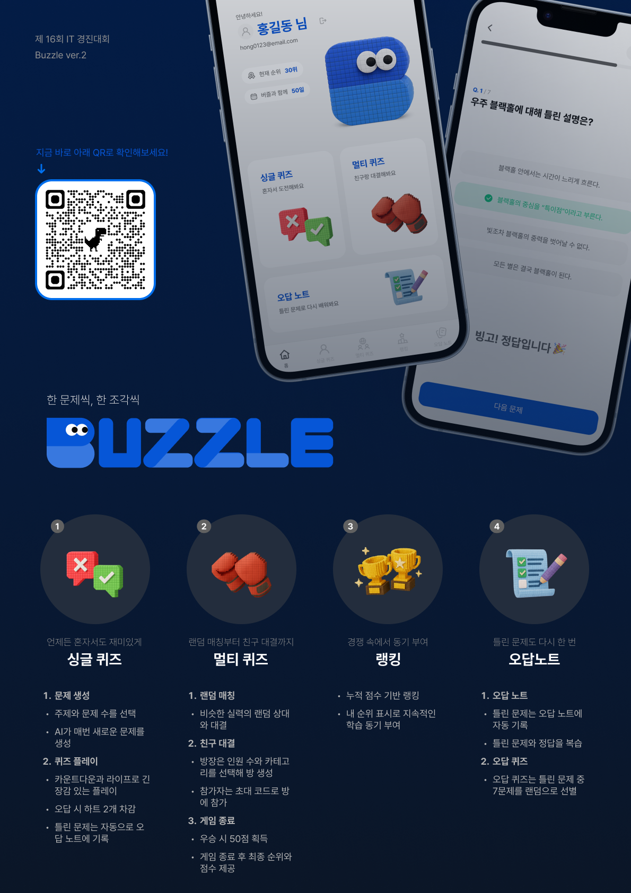

## Buzzle이란?

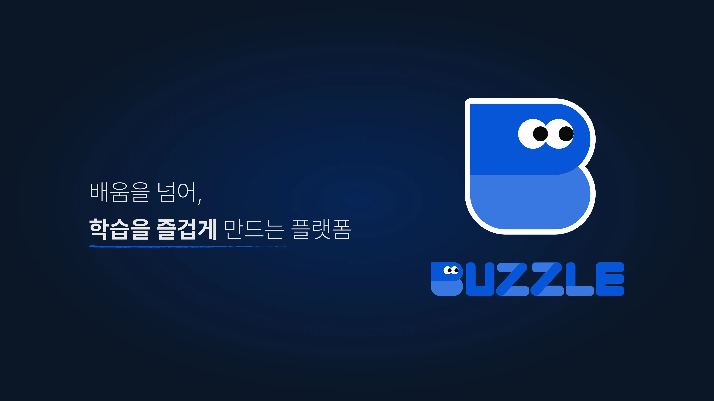
"공부가 게임만큼 재밌을 수는 없을까?"라는 질문에서 시작한 Buzzle은,  
경쟁과 성취를 기반으로, 학습을 즐거운 경험으로 바꿔주는 게임화 플랫폼 입니다.

## 주요 기능

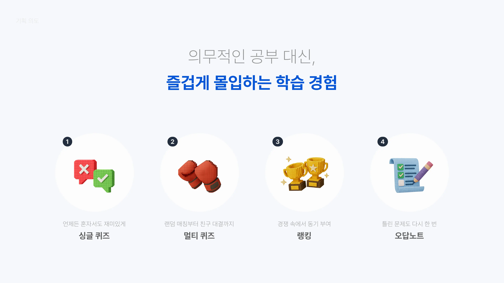
Buzzle은 주요 기능은 4가지입니다.

1. **싱글 퀴즈** : 원하는 문제 수와 카테고리를 선택해 혼자 퀴즈를 풉니다.
2. **멀티 퀴즈**
   - 랜덤 매칭 : 비슷한 실력의 상대와 실시간으로 대결합니다.
   - 친구 대결 : 친구를 초대해 함께 퀴즈 대결을 즐깁니다.
3. **랭킹** : 친구 대결에서 획득한 점수를 기반으로 랭킹을 확인할 수 있습니다.
4. **오답노트** : 틀린 문제를 복습하고, 오답만 모은 복습 퀴즈를 풀 수 있습니다.

## 싱글 퀴즈

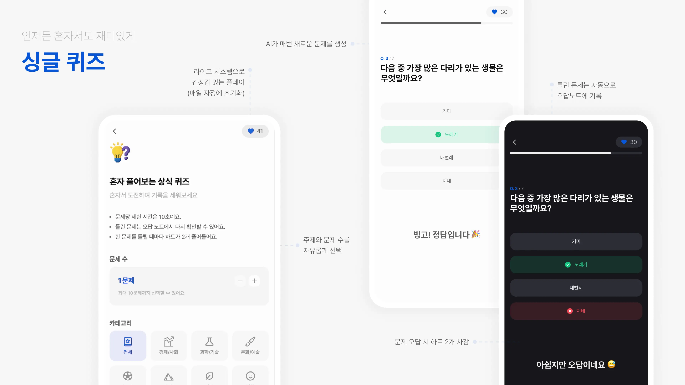

- 다양한 카테고리 중 원하는 주제를 선택해 퀴즈를 풉니다.
- 각 문제는 10초의 제한 시간 안에 풀어야 합니다.
- 틀린 문제는 자동으로 오답 노트에 저장되어 복습할 수 있습니다.
- 오답 시 하트 2개가 차감되며, 하트는 매일 자정에 초기화됩니다.

## 멀티 퀴즈

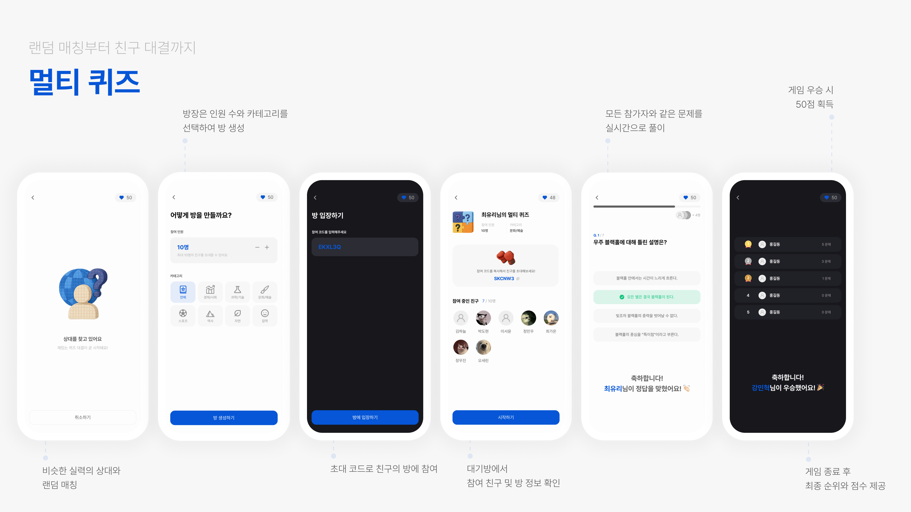

- 멀티 퀴즈는 10초 제한 시간 내에 5문제를 동시에 풉니다.
- 오답 시 3초간의 패널티가 적용됩니다.
- 우승 시 50점을 획득합니다.

### 랜덤 매칭

- 비슷한 실력의 상대와 자동으로 매칭되어 실시간 퀴즈 대결을 진행합니다.

### 친구 대결

- 방장이 카테고리와 인원 수를 선택해 방을 생성합니다.
- 참여자는 대기방의 참여 코드를 입력해 입장할 수 있습니다.
- 대기방에서는 퀴즈 정보와 참여 인원을 확인할 수 있으며, 방장만 게임을 시작할 수 있습니다.
  - 방장이 퇴장하면 방이 자동으로 삭제됩니다.

## 오답노트 & 랭킹

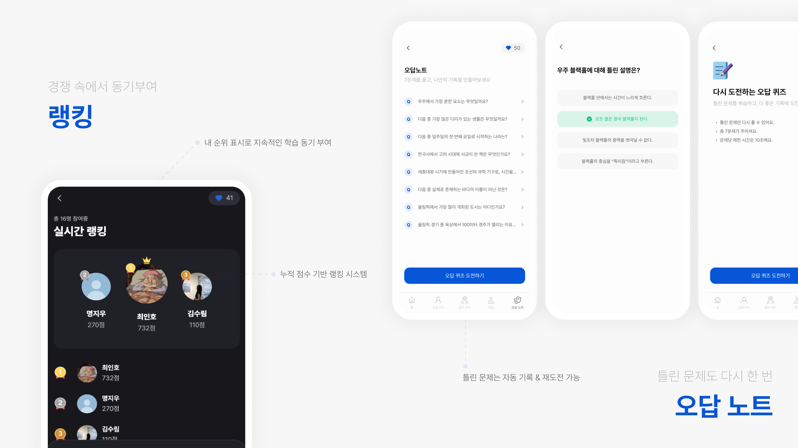

### 오답 노트

- 틀린 문제를 개별로 확인하며 복습할 수 있습니다.
- 오답 중 7문제를 랜덤으로 선정해 ‘오답 퀴즈’를 풀 수 있습니다.

### 랭킹

- 멀티 퀴즈 우승 시 50점을 획득합니다.
- 누적 점수를 기반으로 랭킹이 산정됩니다.

## 기술적 특징

### 모노레포

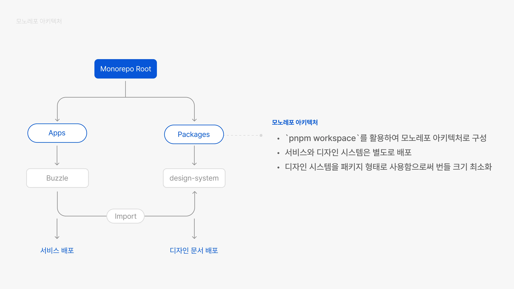

### 자체 디자인 시스템

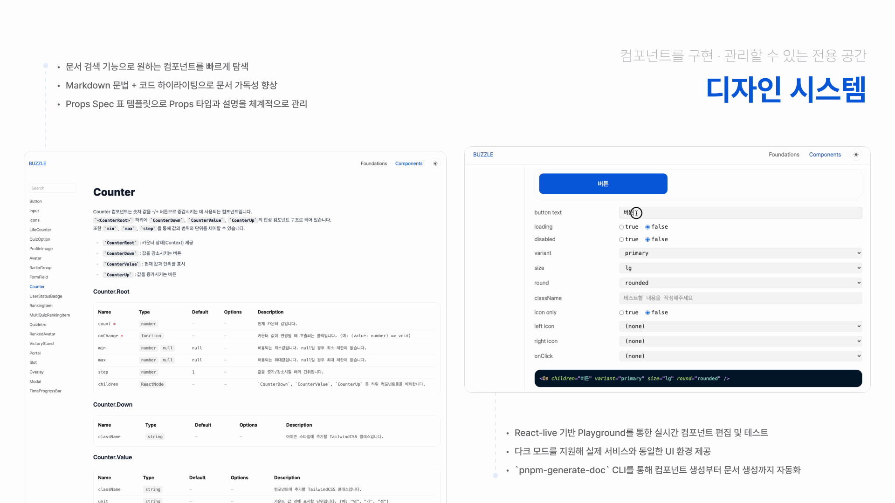

### 배포 및 Preview 자동화

- S3 + CloudFront를 통해 HTTPS 기반의 정적 웹 호스팅을 구현했습니다.
- GitHub Actions로 빌드 결과를 자동으로 S3 버킷에 배포하고, CloudFront 캐시를 무효화하여 최신 버전을 즉시 반영합니다.
- PR Preview 워크플로우를 구성해 PR 생성 시 자동으로 미리보기 환경을 배포합니다.
- CloudFront Functions를 활용해 접속 URL을 브랜치별로 분기 처리했습니다.
- PR 종료 시 Cleanup 워크플로우로 불필요한 리소스를 자동 제거합니다.
- PR Preview 환경을 통해 CI 결과와 실제 UI 변화를 시각적으로 확인, 코드 리뷰 품질 향상시켰습니다.

## 기술 스택

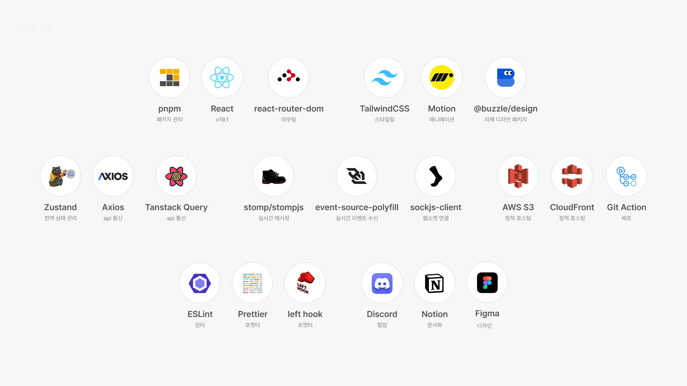
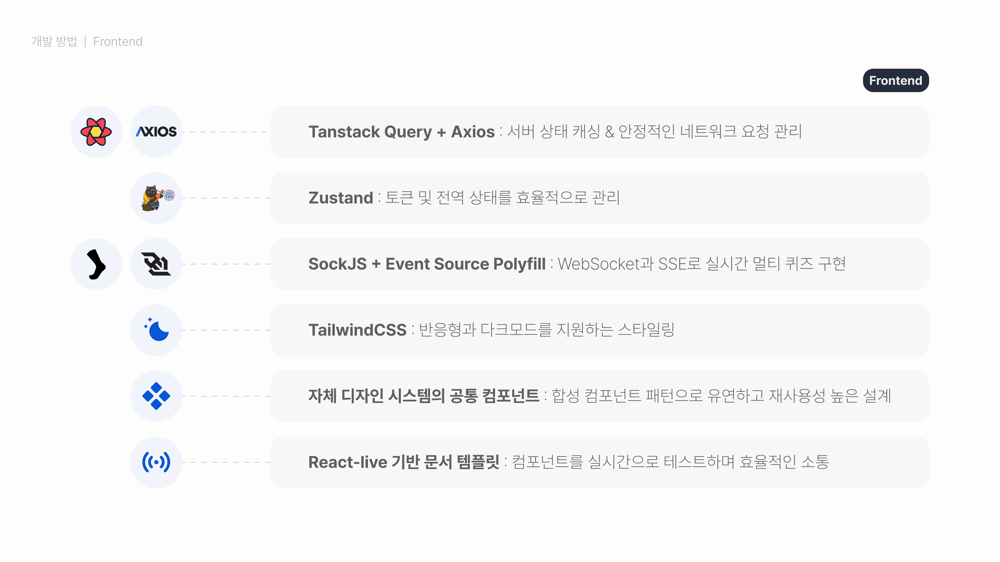

## 개발 일정

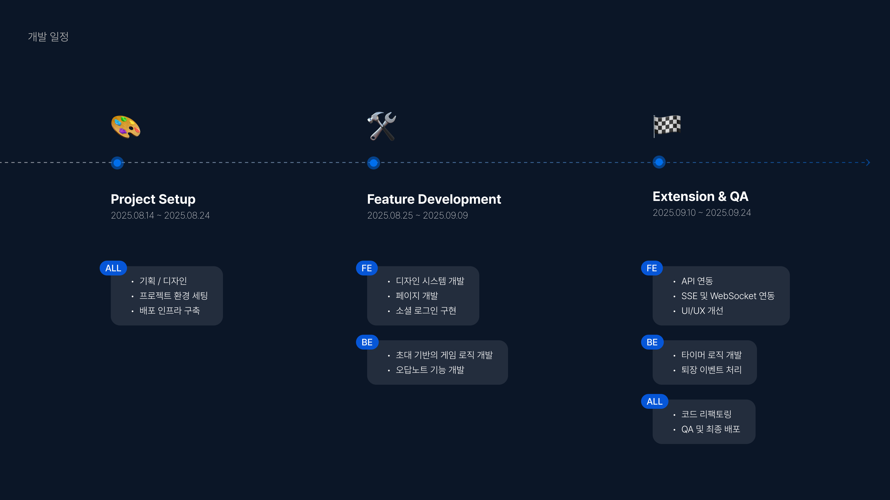

## 팀 구성

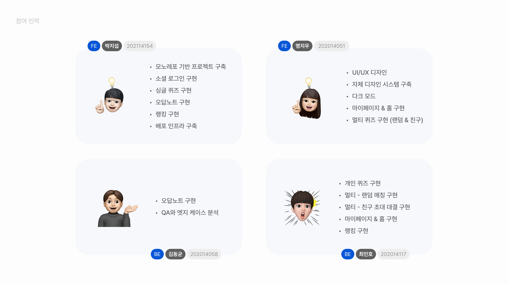
